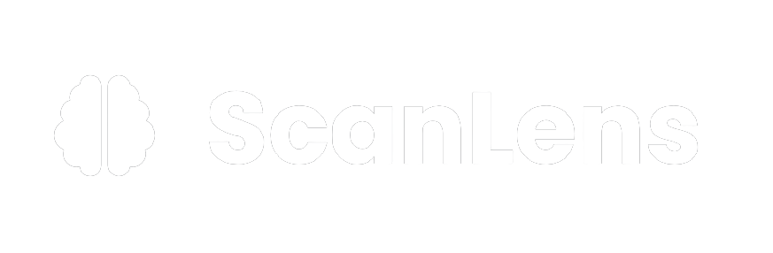
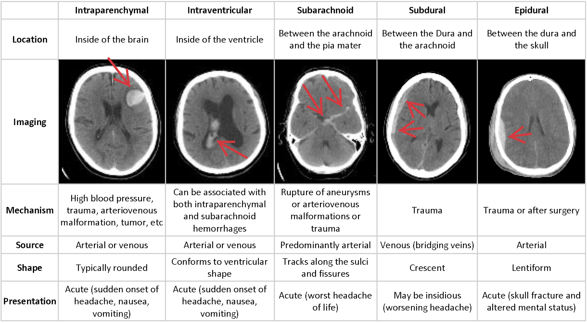
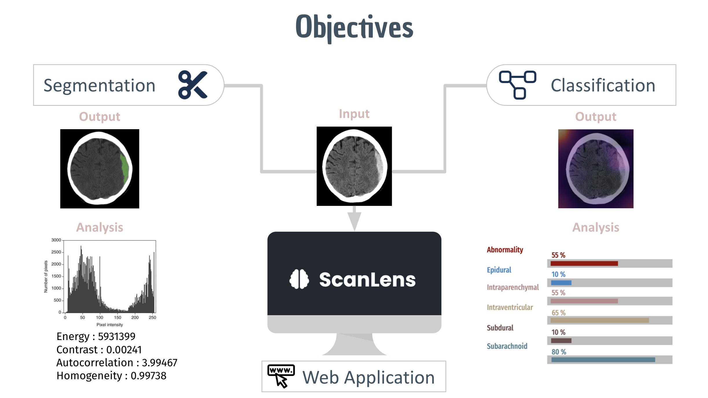

# Name of the project &middot; [](https://travis-ci.org/npm/npm) [](https://www.npmjs.com/package/npm) [](http://makeapullrequest.com) [](https://github.com/your/your-project/blob/master/LICENSE)
> Additional information or tag line


## Context and Problem Statement
Intracranial hemorrhage or ICH is bleeding that occurs inside the brain or skull. It’s a serious condition and requires urgent treatment and accurate diagnosis, otherwise, delay in treatment or miss-diagnosing can cause severe side effects. Based on the location of the hemorrhage, ICH is divided into five subtypes which are intraparenchymal, intraventricular, subarachnoid, subdural, and epidural.
If a stroke due to brain bleeding has occurred, the cause must be determined so that the appropriate treatment can be started. Prompt medical treatment can help limit damage to the brain, which will improve your chances of recovery. However, identifying the location and type of any bleeding present is a critical step in the treatment of the patient. The process of examining CT scans of the patient's skull for the presence, location, and type of bleeding requires highly trained specialists and is often complicated and time-consuming.
    

<small align="center" >ICH Subtypes</small>


## Objectives
The objective of the project is to design an AI (deep learning) powered web platform to assist clinicians to:
1. Predict the presence of hemorrhage from CT scan image using Deep learning approach (CNN and its variants).
2. Provide an interactive interface to allow them to extract statistical biomarkers from affected areas of the brain image using image segmentation techniques.


<small align="center" >Project Objectives</small>


## Method
Our approach consists of two main parts. The first part aims to perform region growing-based image segmentation to segment the damaged region of the brain, extracts biomarker features using the PyRadiomics package and compute the histogram distribution from the intensity of the segmented region. The second part aims to develop a CNN model to predict the abnormality from the CT scan images. On top of this, a Multi-label CNN Model is developed to predict the probabilities of the subtype(s) if an abnormality is discovered. Finally, the classified images are  analyzed visually using the GradCam tool. A web application is also created with ReactJS on the front end, Django on the back end and REST API for communication between the front and back ends to assist the clinician in the analysis of CT scan images.

## Impact
The project provides an employable solution for radiologists to assess in diagnosing and treating Intracranial Hemorrhage with a simple web application.The project enhances the medical procedure to treat Intracranial hemorrhage and accelerates the diagnosis process.

## Usage 

### **Backend**
1. Create new environment and install dependencies:

    a. usinng pip

    ```python -m venv venv```

    ```pip install -r requirements.txt```
    
    b. using anaconda

    ```python -m venv venv```

    ```conda install --file requirements.txt```

3. Start the Django web server
    
    ```cd backend ```
    
    ```python manage.py runserver```

### **Frontend**
4. Open a new terminal and start the node server

    ```cd frontend ```
    
     ``` npm install```     (only if this is your first time to use the app)
    
    ``` npm start```


#### `npm start`

Runs the app in the development mode.\
Open [http://localhost:3000](http://localhost:3000) to view it in the browser.

The page will reload if you make edits.\
You will also see any lint errors in the console.


## Authors
<table>
<tr>
<td align="center"><a href="https://github.com/inesriahi"><br /><sub><b>Ines<br/>Riahi</b></sub></td>
<td align="center"><a href="https://github.com/Shidhani"><br /><sub><b>Aafaq<br/>Al Shidhani</br></sub></td>
<td align="center"><a href="https://github.com/maimuna99"><br /><sub><b>Maimoona<br/>Al Wahaibi</br></sub></td>
<td align="center"><a href="https://github.com/Nuha28"><br /><sub><b>Nuha<br/>Al Rasbi</br></sub></td>
</table>